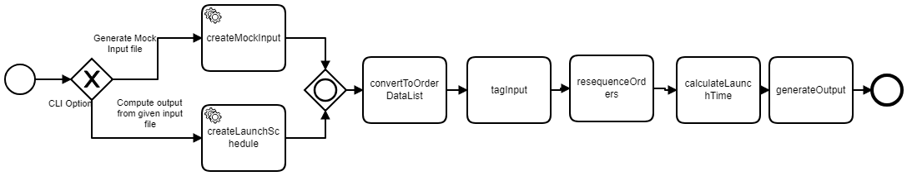

# Walmart Drone Delivery Challenge


----------------
## Problem gist

Optimization for Delivery Satisfaction, given 

- Grid village & One drone
- Uniform blocks separated by unit length/time
- 6AM to 10PM delivery
- Input file sample as follows:  

| ID    | Location | Timestamp |
| ----- | -------- | --------- |
| WM001 | N11W5    | 05:11:50  |
| WM002 | S3E2     | 05:11:55  |
| WM003 | N7E50    | 05:31:50  |
| WM004 | N11E5    | 06:11:50  |

### Complexity   
    
This problem appears to be a variation of the classic Walmart Travelling Salesman Problem or Vehicle Routing Problem, which is classified as NP-Complete. 

Order of complexity then, should be exponential in time to solve (traversing a tree), but polynomial to verify if we assume a path. It is then desirable to use backtracking, that should simplify it to a range in sum-subset optimization problem between two variables. This way it would have been solvable in n! 

However, upon further examinations on conditions and suitable variable selection(details below), it was possible to simplify the two variables into two scalars instead (delivery time (t) and order time-offset (T)) for each order. This allowed it be solved in O(n) alone. 

### Approach

In short, the algorithm will start with taking a first cut among the potential promoters, neutral and detractors. This first cut will be  filtered first by the time-stamp alone. Next we will sort it (first among potential promoters) and then reassess and then optimize the next category.


### Assumptions, basis & consequence 
	       
1. There is no advantage in maintaining any sequence within promoter's, neutral's or detractor's delivery.
		
	**Basis:** The [0-10] customer score within a category does not enter in NPS calculation. 
		
	**Consequence:** Input data can be tagged into three categories bins as the first cut. These tags are subject to adjustment during heuristic calculation. From NPS optimization perspective, the problem boils down to binning as many entries into 'promoter' category and then to bin as many as possible in the 'neutral' category.

	If total number of entries is N; p is number of promoters and n is number of neutrals, then 

/N)*100))  where 

	

2. Input is coming at the beginning of delivery as a flat file(its not a stream and has full information needed for the problem); the file can be assumed to be available just after the last order entry. And file time-stamp range is assumed to flow between 00:00:00 to 23:59:59 (belonging to the same day)

	**Basis:** Real time streaming is not mentioned. Besides, in the example, the last delivery timestamp is after 6AM.
	**Consequence:**		

	 NPS=-100 Case  

		1. All orders are done 3 hours before the last order (so all customers would be are detractors). 

		2. The last order if placed 3 hours before 6 AM, all again are detractors.  

		3. If first order if placed after 10 PM, all are detractors.

3. There is no overhead time for the warehouse to mechanically pick the next delivery, then bring to the launch pad and attach to the drone etc. 
	 
	**Basis:** Should have been explicitly mentioned.

    **Consequence:** No additional term to accumulate and calculate with. 

4. Drone is picking one item at a time. 

	**Basis:** That is usual drone design else multiple complexity may arise about drone capacity, fuel, internal random access etc.
	
	**Consequence:**   Need not consider tricky choices such as shift of origin and density heuristic and recursion.

5. Drone is flying over the grid road (and not diagonally)
	
    **Basis:** Speed is mentioned over vertical or horizontal grid only. No flying regulation complexity mentioned. 
    
    **Consequence:** Input can be taken into a simple data structure like: (X,Y,T,t). Furthermore, since last destination need not be tracked for calculation since drone comes back, and start for any new point from the center. We can be simplified to two coordinates per order - 

    t = Time taken for drone to get to its destination from the launch-pad/center.
    
	T = Time-stamp of the delivery order.
	
If the delivery is done in this sequence: ,(t_{2},T_{2}),...(t_{n},T_{n})) 
	So the 	 delivery will happen after the drone has made back from k-1 destinations in this sequence; that is at time = 
	
 

;where  is the time-stamp of the first launch.

Notice that, once a delivery sequence is determined, the launch time of a delivery does not depend on any of the time-stamps. NPS however, depends upon the time-stamp of that order. For the kth delivery, total time taken for a customer from order to delivery is 


Notice that in calculation of total time for a given order, only t for other orders enters, this implies that ordering by T does not matter. As long as with T, we identify all potential promoters, we can simply sort out the order list by t alone, and that should suffice. Similarly we repeat the process for nuetral batch next. And we have this variation of TSP/VRP solved in O(n) time. 


## Dev:

**Test:**
```
mvn test
```
(unit tests were taken out since spring-shell interferes with the build process. TODO: Disabling Spring part works now, the test will be checked in next) 

**Run:**
```
mvn spring-boot:run
```
Can run from IDE with spring extension. 

## DevOps:

**Build:**
```
mvn clean install -DskipTests
```

it will generate an executable jar in the target folder


**Deploy:**
``` 
java -jar target/wmdrone-0.0.1-SNAPSHOT.jar
```

**Usage**
This will create a shell promt for command line interface

*Example run from the command prompt:*

To create a mock test file:
```
shell:> create-mock-input --n 20 --max-steps 20 --min-hour 03 --max-hour 11
```
To run the launch schedule program
```
shell:> create-schedule <path/to/repo>/wmDrone/src/main/resources/mock-input.txt
```
## BizDevOps

TODO: Here in this repo-branch, I shall introduce an embedded lightweight BPM library. This approach allows for greater vertical visibility and coding flexibility. For instance, here the overview of process flow is implemented as shown in a simplified BPMN. 
	
	Where design of the steps' flow makes it simpler to code with clarity; it solves for two other problem - 
a) it allows one to zoom in to a bug/issue since it is confined between known states and all variables pertaining to any state change are auditable. 
b) any computation intensive step (say if the delivery sequence needed big heuristic calculation) can be refactored and externalized possibly to a server-less implementation. 
