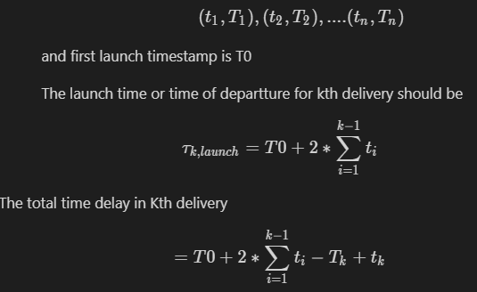

# Walmart Drone Delivery Challenge

## Build and Run

**Build:**
```
mvn clean install -DskipTests
```
it will generate an executable jar in the target folder

**Run:**
``` 
java -jar target/wmdrone-0.0.1-SNAPSHOT.jar
```
This will create a shell promt for command line interface

*Example run from the command prompt:*

To create a mock test file:
```
shell:> create-mock-input --n 20 --max-steps 20 --min-hour 03 --max-hour 11
```
To run the launch schedule program
```
shell:> create-schedule <path/to/repo>/wmDrone/src/main/resources/mock-input.txt
```
----------------
## Problem Summary

Optimzation for Delivery Satisfaction, given 

- Grid village & One drone
- Each block 1 min away
- 6AM to 10PM delivery
- Input file sample
  
  | ID    | Location | TimeStamp |
  | ----- | -------- | --------- |
  | WM001 | N11W5    | 05:11:50  |
  | WM002 | S3E2     | 05:11:55  |
  | WM003 | N7E50    | 05:31:50  |
  | WM004 | N11E5    | 06:11:50  |

### Complexity and Approach  
    
This problem appears to be a variation of the classic Walmart Travelling Salesman Problem or Vehicle Routing Problem, which is classified as NP-Complete. 

If so, Order should be exponential in time to solve (for a tree) however remained polynomial to verify. So it was desirable to use backtracking and simplify it to a range in sum-subset optimization problem between two variables, time to reach and time to order. This way it would have been solvable in n! 

However, upon further examinations on conditions and assumptions and suitable variable selection(details below), it was possible to simplify the two variables into two scalars (delivery &back time (t) and order time-offset (T) for each order and solve it in O(n) alone. 

In short, the algorithm will start with taking a first cut of promoters vs. neutral vs. detractors based off numbers in that give order alone. Next we will sort it (first among potential promoters) and then making few checks and optimize the next category.


### Assumptions, basis & consequence 
	       
1. There is no advantage in maintaining any sequence within promoter's, neutral's or detractor's delivery.
		
	**Basis:** The [0-10] customer score within a category does not enter in NPS calculation. 
		
	**Consequence:** Input data can be tagged into three categories bins as the first cut. These tags are subject to adjustment during hueristic calculation. From NPS optimization perspective, the problem boils down to binning as many entries into 'promoter' category and then to bin as many as possible in the 'neutral' category.

	If total number of entries is N; p is number of promoters and n is number of neutrals, then 
			
$$
 			NPS = (p-(N-p-n))*100/N = 100*(-1+(2*p+n)/N
$$

2. Input is coming at the begining of delivery as a flat file(its not a stream and has full information needed for the problem); the file can be assumed to be available just after the last order entry. And file time-stamp range is assumed to flow between 00:00:00 to 23:59:59 (belonging to the same day)

	**Basis:** Real time streaming is not mentioned. Besides, in the example, the last delivery timestamp is after 6AM.
	**Consequence:**		

	 NPS=-100 Case  

		1. All orders are done 3 hours before the last order (so all customers would be are detractors). 

		2. The last order if placed 3 hours before 6 AM, all again are detractors.  

		3. If first order if placed after 10 PM, all are detractors.

3. There is no overhead time for the warehouse to mechanically pick the next delivery, then bring to the launch pad and attach to the drone etc. 
	 
	**Basis:** Should have been explicitely mentioned.

    **Consequence:** No additional term to accumulate and calculate with. 

4. Drone is picking one item at a time. 

	**Basis:** That is usual drone design else multiple complexity may arise about drone capacity, fuel, internal random access etc.
	
	**Consequence:**   Need not consider tricky choices such as shift of origin and density heuristic and recursion.

5. Drone is flying over the grid road (and not diagonally)
	
    **Basis:** Speed is mentioned over vertical or horizontal grid only. No flying regulation complexity mentioned. 
    
    **Consequence:** Input can be taken into a simple data structure like: (X,Y,T,t). Furthermore, since last destination need not be tracked (everytime starts with origin) for calculation purposes, we can be simplifed to two coordinates per order - 

    t = Time taken for drone to get to its destination from launch-pad at the center.
    
	T = Time offest of a given order prior to the start of delivery. 
    
	so if the delivery is done in this following sequence: 

	
Notice that in calculation of total time for a given order, only t for other orders enters, this implies that ordering by T does not matter. As long as with T, we identify all potential promoters, we can simply sort out the order list by t alone, and that should suffice. Similarly we repeat the process for nuetral batch next. And we have this variation of TSP/VRP solved in O(n) time. 

The overview of process flow is implemented as shown in a simplified BPMN. 
	